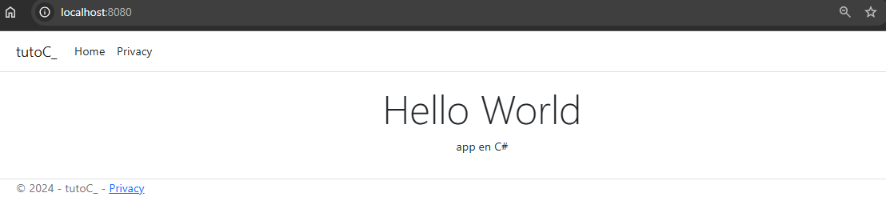

# TutoC-: ASP.NET Core Application

This project is a simple application developed with ASP.NET Core, which displays a "Hello World" message in the browser.

<div align="center">
    
</div>

## System Requirements

- .NET SDK 8.0 or higher.
- Docker (optional, for container deployment).

## Installation and Usage Guide

### Local Installation

1. Clone the repository:

    ```bash
    git clone https://github.com/Jonablo/tutoC-
    ```

2. Navigate to the project directory:

    ```bash
    cd tutoC-
    ```

3. Run the application:

    ```bash
    dotnet run
    ```

4. Access the application at `http://localhost:8080` in your browser.

### Using Docker

If you prefer to use the pre-built Docker image, follow these steps:

1. Pull the image from Docker Hub:

    ```bash
    docker pull jonablo/tutoc-app
    ```

2. Run the image:

    ```bash
    docker run -p 8080:8080 jonablo/tutoc-app
    ```

3. Access the application at `http://localhost:8080`.

## License

This project is licensed under the MIT License.
